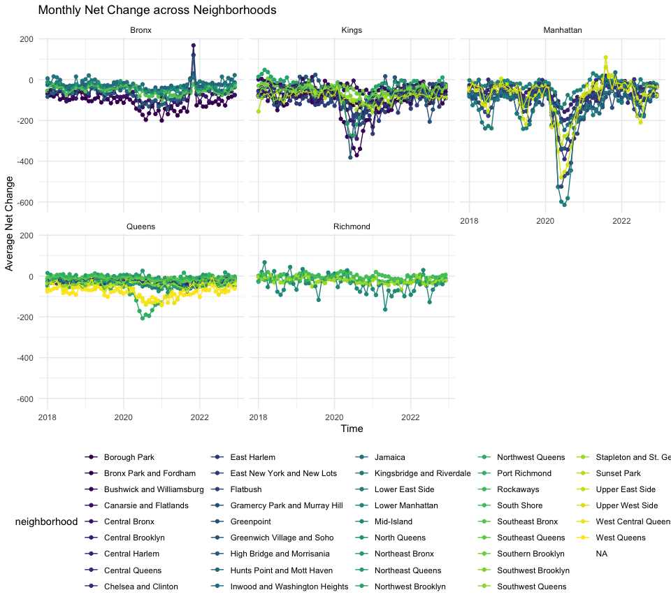

p8105_mtp_zz3168
================
Zixuan Zhang
2023-10-20

``` r
library(readr)
library(readxl)
library(tidyverse)
```

    ## ── Attaching core tidyverse packages ──────────────────────── tidyverse 2.0.0 ──
    ## ✔ dplyr     1.1.3     ✔ purrr     1.0.2
    ## ✔ forcats   1.0.0     ✔ stringr   1.5.0
    ## ✔ ggplot2   3.4.3     ✔ tibble    3.2.1
    ## ✔ lubridate 1.9.2     ✔ tidyr     1.3.0
    ## ── Conflicts ────────────────────────────────────────── tidyverse_conflicts() ──
    ## ✖ dplyr::filter() masks stats::filter()
    ## ✖ dplyr::lag()    masks stats::lag()
    ## ℹ Use the conflicted package (<http://conflicted.r-lib.org/>) to force all conflicts to become errors

``` r
library(dplyr)
library(ggplot2)
library(tidyr)

knitr::opts_chunk$set(
    echo = TRUE,
    warning = FALSE,
    fig.width = 10, 
  fig.height = 9,
  out.width = "90%"
)

theme_set(theme_minimal() + theme(legend.position = "bottom"))

options(
  ggplot2.continuous.colour = "viridis",
  ggplot2.continuous.fill = "viridis"
)

scale_colour_discrete = scale_colour_viridis_d
scale_fill_discrete = scale_fill_viridis_d
```

## Problem 1

\##Data import, cleaning, and quality control We import, organize, and
merge data sets, and then delete erroneous data from the merged table
through identification. Then we use statistics and visualization to
analyze and identify trends in the data set.

The original data includes New York City’s COA data from 2018 to 2022
and `zip_data` data that accurately reflects New York City’s counties,
boroughs, and communities. These include `borough` variables,
`net_change` variable, `zip_code`, `month` and other important data.

We first synthesize the COA data from 2018 to 2022 in `coa_data`, then
convert the time into `month`, `year`, `date`, and use
`total_perm_in - total_perm_out` to get the data of `net_change`. By
combining the data of `zip_data` and `coa_data`, we found that some
erroneous overlaps appeared in the total data table, and obtained a new
data table through exclusion.

``` r
coa_data_1 = read_xlsx("data/USPS CHANGE OF ADDRESS NYC.xlsx", sheet = c("2018")) 
  coa_data_2 = read_xlsx("data/USPS CHANGE OF ADDRESS NYC.xlsx", sheet = c("2019")) 
coa_data_3 = read_xlsx("data/USPS CHANGE OF ADDRESS NYC.xlsx", sheet = c("2020")) 
coa_data_4 = read_xlsx("data/USPS CHANGE OF ADDRESS NYC.xlsx", sheet = c("2021")) 
coa_data_5 = read_xlsx("data/USPS CHANGE OF ADDRESS NYC.xlsx", sheet = c("2022"))

coa_data = 
  bind_rows(coa_data_1,coa_data_2,coa_data_3,coa_data_4,coa_data_5) |> 
  janitor::clean_names() |> 
  mutate(time = month) |> 
  separate(month, into = c("year", "month", "date") ) |> 
  mutate(net_change = total_perm_in - total_perm_out) |> 
  rename(zip_code = zipcode) 
 


zip_data = read_csv("data/Zip Codes.csv") |> 
  janitor::clean_names() |> 
  mutate(borough = ifelse(county_name == "New York", "Manhattan", county_name)) 
```

    ## Rows: 324 Columns: 7
    ## ── Column specification ────────────────────────────────────────────────────────
    ## Delimiter: ","
    ## chr (4): County Name, County Code, File Date, Neighborhood
    ## dbl (3): State FIPS, County FIPS, ZipCode
    ## 
    ## ℹ Use `spec()` to retrieve the full column specification for this data.
    ## ℹ Specify the column types or set `show_col_types = FALSE` to quiet this message.

``` r
combine_data = 
  inner_join(zip_data, coa_data,by="zip_code") |> 
  filter(!(borough == "Manhattan" & zip_code == 10463) &
          !(borough == "Manhattan" & zip_code == 11201) &
          !(borough == "Queens" & zip_code == 11239) &
          !(borough == "Kings" & zip_code == 11693))
```

\##describe Tidy Dataset Through the combined data table `combine_data`
we get that there are a total of 11845 data, including 237 unique postal
codes and 42 unique communities

``` r
#unique_zips
combine_data |> 
  select(zip_code) |> 
  distinct() |> 
  head(n = 10) |> 
  knitr::kable()
```

| zip_code |
|---------:|
|    10451 |
|    10452 |
|    10453 |
|    10454 |
|    10455 |
|    10456 |
|    10457 |
|    10458 |
|    10459 |
|    10460 |

``` r
#unique_neighborhoods
combine_data |> 
  drop_na() |> 
  select(neighborhood) |> 
  distinct() |> 
  knitr::kable()
```

| neighborhood                  |
|:------------------------------|
| High Bridge and Morrisania    |
| Central Bronx                 |
| Hunts Point and Mott Haven    |
| Bronx Park and Fordham        |
| Southeast Bronx               |
| Kingsbridge and Riverdale     |
| Northeast Bronx               |
| Northwest Brooklyn            |
| Flatbush                      |
| Borough Park                  |
| Bushwick and Williamsburg     |
| East New York and New Lots    |
| Southwest Brooklyn            |
| Greenpoint                    |
| Central Brooklyn              |
| Sunset Park                   |
| Southern Brooklyn             |
| Canarsie and Flatlands        |
| Chelsea and Clinton           |
| Lower East Side               |
| Lower Manhattan               |
| Gramercy Park and Murray Hill |
| Greenwich Village and Soho    |
| Upper East Side               |
| Upper West Side               |
| Central Harlem                |
| East Harlem                   |
| Inwood and Washington Heights |
| Southeast Queens              |
| Northwest Queens              |
| North Queens                  |
| Northeast Queens              |
| Central Queens                |
| West Queens                   |
| West Central Queens           |
| Jamaica                       |
| Southwest Queens              |
| Rockaways                     |
| Stapleton and St. George      |
| Port Richmond                 |
| South Shore                   |
| Mid-Island                    |

\##Compare city By comparing Manhattan and Queens, we found that New
York has the largest proportion in Manhattan, with 3477, followed by
CANAL STREET, ROOSEVELT ISL, etc. Their data are very different. In the
data of Queens, JAMAICA accounts for the largest proportion at 372,
followed by FLUSHING, ASTORIA, etc., but their data are not very
different.

``` r
#manhateen
combine_data |> 
  filter(borough == "Manhattan") |> 
  count(city) |> 
  arrange(desc(n)) |> 
  mutate(rank = row_number()) |> 
  filter(rank < 7) |> 
  knitr::kable()
```

| city             |    n | rank |
|:-----------------|-----:|-----:|
| NEW YORK         | 3477 |    1 |
| CANAL STREET     |    4 |    2 |
| ROOSEVELT ISL    |    4 |    3 |
| ROOSEVELT ISLAND |    4 |    4 |
| BOWLING GREEN    |    1 |    5 |
| NYC              |    1 |    6 |

``` r
#queen
combine_data |> 
  filter(borough == "Queens") |> 
  count(city) |> 
  arrange(desc(n)) |> 
  mutate(rank = row_number()) |> 
  filter(rank < 7) |> 
  knitr::kable()
```

| city             |   n | rank |
|:-----------------|----:|-----:|
| JAMAICA          | 372 |    1 |
| FLUSHING         | 309 |    2 |
| ASTORIA          | 230 |    3 |
| QUEENS VILLAGE   | 165 |    4 |
| BAYSIDE          | 135 |    5 |
| LONG ISLAND CITY | 120 |    6 |

## Problem 2

\#EDA We created a table to show the averages for each borough and year.
According to the `average_df` data, Manhattan’s average has the largest
difference, and Richmond’s average has the smallest difference.

``` r
combine_data |> 
  group_by(borough, year) |> 
  summarize(average_df = mean(net_change, na.rm = TRUE)) |> 
  mutate(year = as.integer(year)) |> 
  knitr::kable()
```

    ## `summarise()` has grouped output by 'borough'. You can override using the
    ## `.groups` argument.

| borough   | year |  average_df |
|:----------|-----:|------------:|
| Bronx     | 2018 |  -46.303333 |
| Bronx     | 2019 |  -48.016667 |
| Bronx     | 2020 |  -72.653333 |
| Bronx     | 2021 |  -66.100000 |
| Bronx     | 2022 |  -53.190000 |
| Kings     | 2018 |  -47.356688 |
| Kings     | 2019 |  -53.182590 |
| Kings     | 2020 | -113.483402 |
| Kings     | 2021 |  -78.663865 |
| Kings     | 2022 |  -56.651064 |
| Manhattan | 2018 |  -41.967422 |
| Manhattan | 2019 |  -52.784773 |
| Manhattan | 2020 | -126.434610 |
| Manhattan | 2021 |  -38.975504 |
| Manhattan | 2022 |  -46.588055 |
| Queens    | 2018 |  -26.224115 |
| Queens    | 2019 |  -28.713342 |
| Queens    | 2020 |  -47.480106 |
| Queens    | 2021 |  -44.715621 |
| Queens    | 2022 |  -30.368065 |
| Richmond  | 2018 |   -9.846154 |
| Richmond  | 2019 |   -9.125000 |
| Richmond  | 2020 |  -10.544828 |
| Richmond  | 2021 |  -22.548611 |
| Richmond  | 2022 |  -16.298611 |

\##lowest values and highest Two tables were created to show the five
lowest values in the data and the five highest values for 2020. The
lowest value in `net_change` is -983, and the highest value in 2020 is
360 in `net_change`.

``` r
#lowest
combine_data |> 
  arrange(net_change) |> 
  select(zip_code, neighborhood, year, month, net_change) |> 
  head(n = 5) |> 
  knitr::kable()
```

| zip_code | neighborhood                  | year | month | net_change |
|---------:|:------------------------------|:-----|:------|-----------:|
|    10022 | Gramercy Park and Murray Hill | 2020 | 05    |       -983 |
|    10009 | Lower East Side               | 2020 | 07    |       -919 |
|    10016 | Gramercy Park and Murray Hill | 2020 | 06    |       -907 |
|    10016 | Gramercy Park and Murray Hill | 2020 | 07    |       -855 |
|    10009 | Lower East Side               | 2020 | 06    |       -804 |

``` r
#highest
combine_data |> 
  filter(year < 2020) |> 
  arrange(desc(net_change)) |> 
  select(zip_code, neighborhood, year, month, net_change) |> 
  head(n = 5) |> 
  knitr::kable()
```

| zip_code | neighborhood        | year | month | net_change |
|---------:|:--------------------|:-----|:------|-----------:|
|    11101 | Northwest Queens    | 2018 | 04    |        360 |
|    11101 | Northwest Queens    | 2018 | 06    |        344 |
|    11101 | Northwest Queens    | 2018 | 05    |        300 |
|    10001 | Chelsea and Clinton | 2018 | 07    |        225 |
|    11201 | Northwest Brooklyn  | 2018 | 04    |        217 |

## Visualization:

Based on the ggplot chart, we can derive the community-level average
versus month over the five years. Manhattan still has the most data
among the five communities, but its average difference in 2020 is larger
than the other four communities. Richmond’s average has the least
correlation with the month, but its average is much more stable than the
other four communities.

``` r
combine_plot = 
  combine_data |> 
  mutate(month = as.integer(month),
         year = as.integer(year))


combine_plot |> 
  group_by(year, time, neighborhood, borough) |> 
  summarize(average_change = mean(net_change, na.rm = TRUE)) |> 
  ggplot(aes(x = time, 
             y = average_change, 
             color = neighborhood)
       ) +
  geom_point()+
  geom_line() + 
  facet_wrap(~borough) +
  labs(title = "Monthly Net Change across Neighborhoods", 
       x = "Time", 
       y = "Average Net Change")
```

    ## `summarise()` has grouped output by 'year', 'time', 'neighborhood'. You can
    ## override using the `.groups` argument.



``` r
# Export the plot
ggsave("results/city change.pdf")
```

    ## Saving 10 x 9 in image
